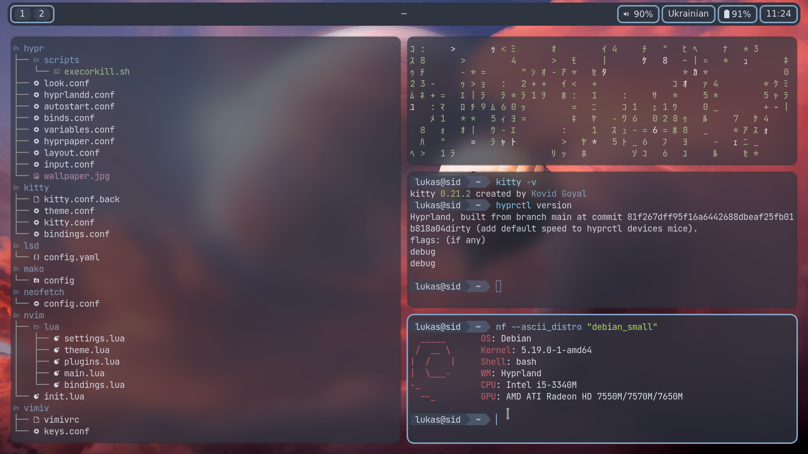
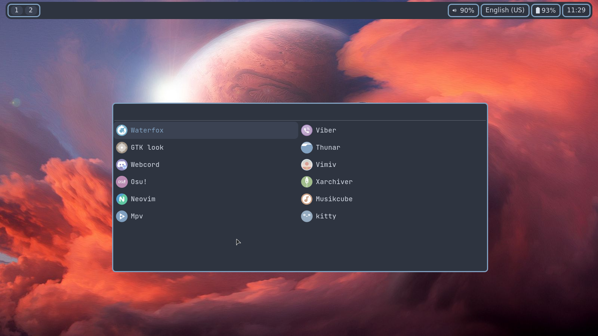
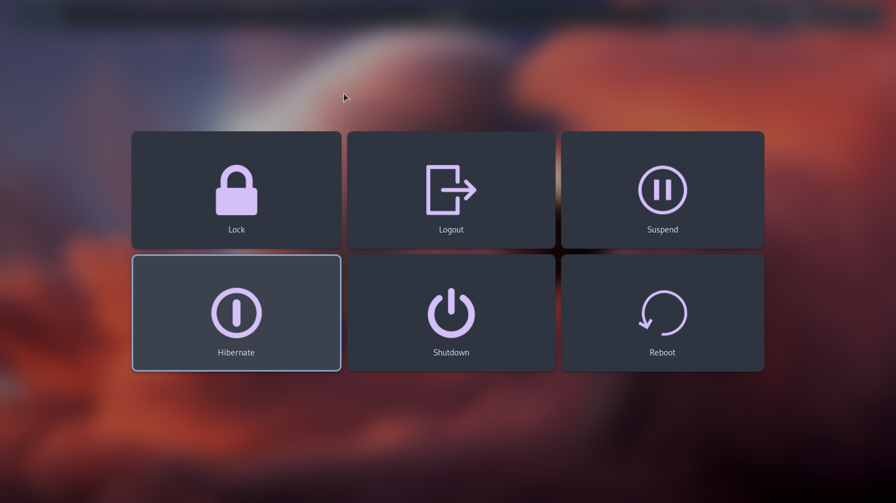
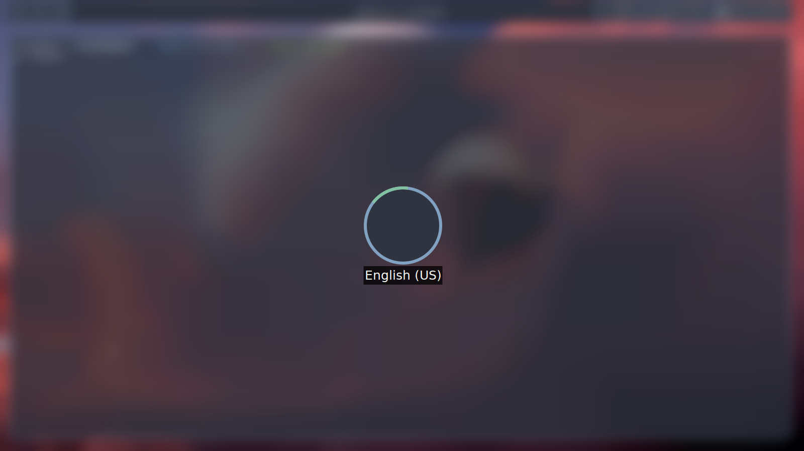

# hi, its my dotfiles

<table align="center">
  <tr>
    <td>
      
    </td>
    <td>
      
    </td>
  </tr>
  <tr>
    <td>
      
    </td>
    <td>
      
    </td>
  </tr>
</table>

```yaml
OS: debian sid
WM: hyprland
SHELL: bash
icon_theme: Zafiro-Nord-Black #added some changed icons from papirus
gtk_theme: NordArc-Theme
cusror: volantes_cursors

programs:
  menu: wofi
  code_editor: neovim
  terminal: kitty
  bar: waybar
  lock_user: swaylock-effects
  logout_menu: wlogout
  video_player: mpv
  music_player: musikcube
  image_viewer: vimiv
  file_manager: thunar
  archiver: xarchiver
  screenshots: grim + slurp
```
